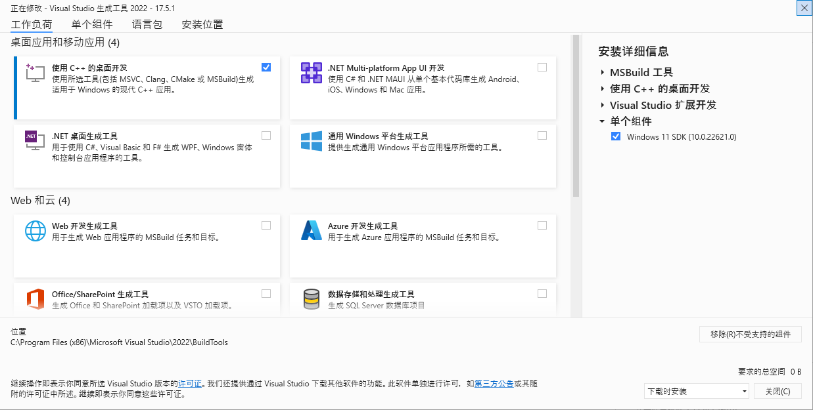

Onnx 作为一个主力是微软维护的项目, 想必在 Windows 上编译会非常简单吧?

这你就年轻了, 坑的就是 Windows 用户.

## Requirements

首先安装 [Visual Studio](https://visualstudio.microsoft.com/zh-hans/), 因为装 CUDA 会检测 VS 然后魔改

如果顺序反了, 手动把 BuildCustomizations 都复制到 MSBuildExtensions 即可, 注意版本号会有所差别.

```yaml
C:\Program Files\NVIDIA GPU Computing Toolkit\CUDA\v11.6\extras\visual_studio_integration\MSBuildExtensions
C:\Program Files (x86)\Microsoft Visual Studio\2022\BuildTools\MSBuild\Microsoft\VC\v170\BuildCustomizations
```

---

VS 装的时候把第一个 C++ 勾上就行



我们只要 C++ MSVC 工具链, 外加 Windows SDK, 不需要 VS!!!

用 VS 打开项目立马卡死, 外加生成一堆垃圾...

然后在 Build 里勾勾勾改改改改半天, 最后也不是不能成功, 就是过程极度痛苦...

VS 版本关系到后面的编译参数, 具体为:

| VS Version | `--cmake_generator`     |
|------------|-------------------------|
| 2017       | `Visual Studio 15 2017` |
| 2019       | `Visual Studio 16 2019` |
| 2022       | `Visual Studio 17 2022` |

然后看需要哪些版本的 Cuda/TensorRT

- [TensorRT](https://onnxruntime.ai/docs/execution-providers/TensorRT-ExecutionProvider.html#requirements)
- [CUDA](https://onnxruntime.ai/docs/execution-providers/CUDA-ExecutionProvider.html#requirements)

|      ONNX | CUDA |    CUDNN | TensorRT |
|----------:|-----:|---------:|---------:|
|      1.14 | 11.6 | 8.5.0.96 |      8.5 |
| 1.12-1.13 | 11.4 | 8.5.0.96 |      8.4 |
|      1.11 | 11.4 | 8.2.2.26 |      8.2 |
|      1.10 | 11.4 | 8.2.2.26 |      8.0 |

查表找对应的版本下载, 不要下最新的, 不然痛苦面具又要戴上

- [CUDA](https://developer.nvidia.com/cuda-toolkit-archive)
- [cuDNN](https://developer.nvidia.com/rdp/cudnn-archive)
- [TensorRT](https://developer.nvidia.com/nvidia-tensorrt-7x-archive)

然后可以开始 clone 了, 用 `--recursive` 是因为要下载 submodules, 用 `--depth 1` 是因为不需要历史记录

```sh
git clone https://github.com/microsoft/onnxruntime.git --recursive --depth 1
```

submodule 可能会失败, 失败了也别管, 丢失的那部分和编译没任何关系

## Build

然后别去看 CMAKE, 看了立马带上痛苦面具, 有个好东西叫 `build.py`

哦对, 你还得装个 python.

出现的所有路径必须使用绝对路径, 相对路径的话 cmake 各种找不到

```shell
export CudaToolkitCustomDir="C:/Program Files/NVIDIA GPU Computing Toolkit/CUDA/v11.6"
python3 ./onnxruntime/tools/ci_build/build.py \
  --cmake_generator "Visual Studio 17 2022" \
  --build_dir ./target/ \
  --config Release \
  --parallel 8 \
  --use_cuda \
  --use_tensorrt \
  --cuda_version 11.6 \
  --cuda_home "C:/Program Files/NVIDIA GPU Computing Toolkit/CUDA/v11.6" \
  --cudnn_home "D:\models\static-onnx\CUDNN-8.8.1.3" \
  --tensorrt_home "D:/models/static-onnx/TensorRT-8.5.3.1" \
  --enable_lto \
  --enable_msvc_static_runtime \
  --skip_tests \
  --skip_submodule_sync
```

- CUDA 的 find 有问题, 所以写了两遍
- `--skip_submodule_sync`: 因为种种原因, submodule 问题很多, 跳过别管最好
- `--enable_msvc_static_runtime`: 静态链接 msvc, windows 默认开启的, 我怕他哪天 cmake 改了, 保险起见手动开启下

然后配下 CUDA, CUDNN, TensorRT 路径, 没写的话会去读环境变量

但我这个机器里面有六个 CUDA, 容易乱套, 还是手动标记下吧.

TVM 别开, LLVM 别开, 你开了就别想编译成功了.

---

然后看着 CPU 全部跑满, 心满意足的去睡一觉.
